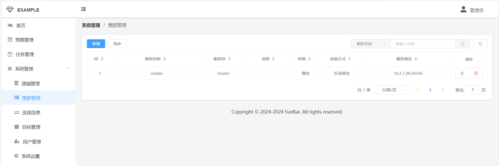

<h3 align="center">MySQL数据治理平台</h3>
<p align="center">
  <a href="https://github.com/sunkaimr/data-loom/blob/main/LICENSE"></a>
</p>


------------------------------

## 系统介绍

### 系统概览





### 相关文章

- 
### 特点

- 
- 
- 

### 主要功能

- 1
- 2
- 3

## 安装

### Docker 一键快速构建

[//]: # "> 方法一"
-  先安装 Docker 环境, 以及Docker Compose
- 拷贝项目
```shell 
git clone https://github.com/sunkaimr/data-loom.git --depth=1
```
- 第三步：进入主目录，执行:
```
docker compose up -d
```

### 本地开发环境搭建

### Makefile 安装

## 验证
- 浏览器打开: [http://127.0.0.1:8080](http://127.0.0.1:8080
- username: admin
- password: 123456

